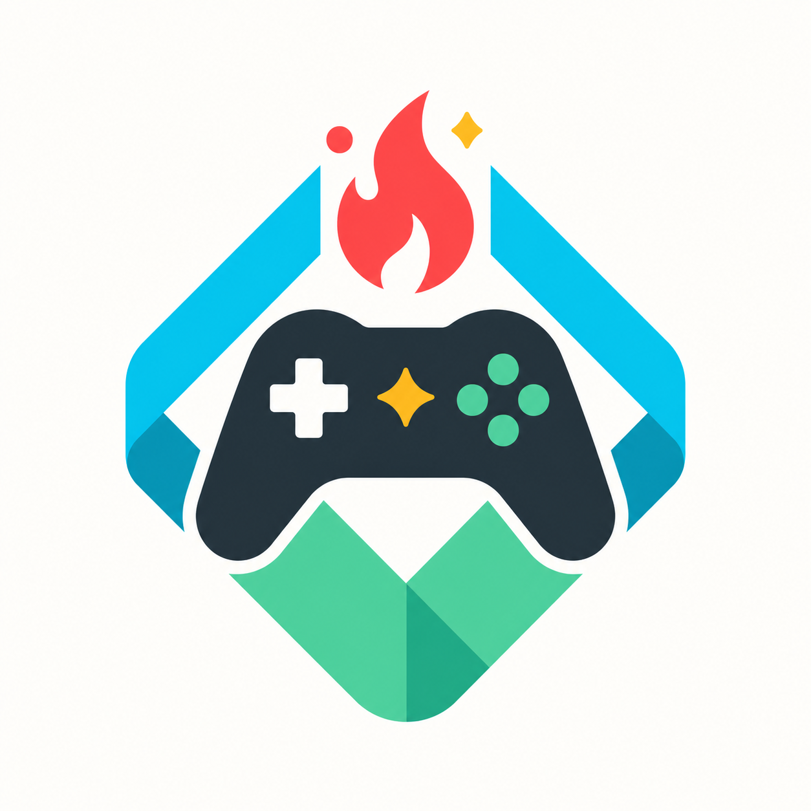
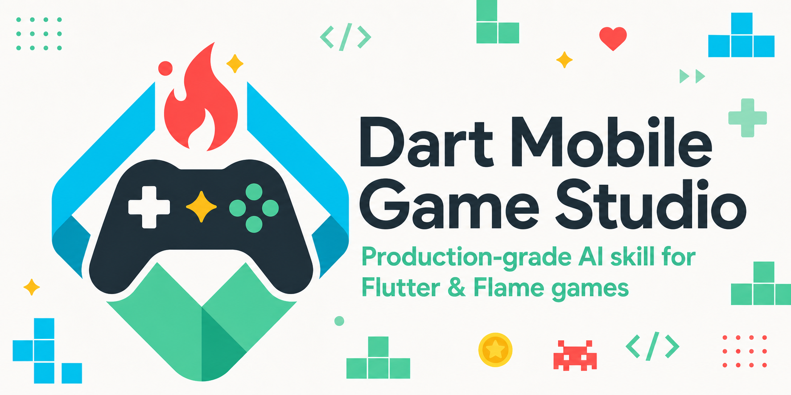
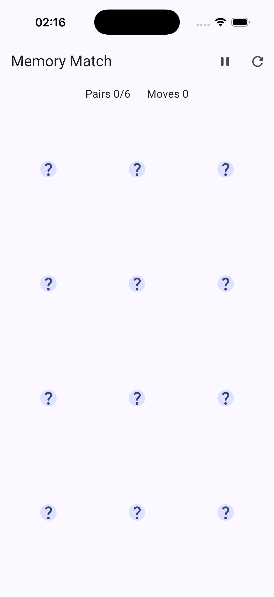
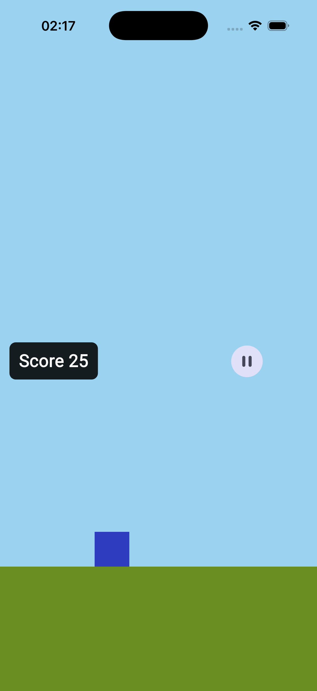
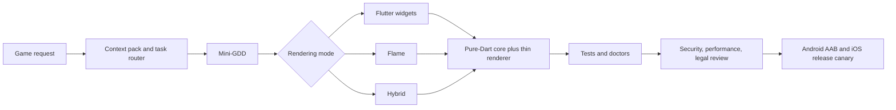

<p align="center">
  
</p>

<h1 align="center">Dart Mobile Game Studio</h1>

<p align="center">
  A production-grade AI agent skill for building polished 2D Flutter and Flame games<br>
  for iOS, iPadOS, and Android from one testable Dart codebase.
</p>

<p align="center">
  <a href="https://github.com/Zulut30/dart-mobile-game-studio/actions/workflows/ci.yml"></a>
  <a href="https://github.com/Zulut30/dart-mobile-game-studio/actions/workflows/release-canary.yml"></a>
  <a href="https://github.com/Zulut30/dart-mobile-game-studio/releases"></a>
  <a href="LICENSE"></a>
  
</p>

<p align="center">
  <a href="README.ru.md">Русская версия</a> ·
  <a href="docs/installation.md">Installation</a> ·
  <a href="docs/architecture.md">Architecture</a> ·
  <a href="CONTRIBUTING.md">Contributing</a>
</p>

<p align="center">
  
</p>

## What it is

Dart Mobile Game Studio is not a runtime package imported by your app. It is a
portable operating system for coding agents: instructions, specialist roles,
game templates, review policies, and executable quality gates that lead an AI
agent from an idea to tested mobile release artifacts.

It is designed for Codex, Claude Code, and Cursor, with one canonical source in
`.agents/` and synchronized tool-specific distributions.

## Why teams use it

- **Testable by construction.** Rules and state machines stay in pure Dart;
  Flutter and Flame remain thin renderers.
- **Three rendering modes.** Widgets-only for boards and puzzles, Flame for
  continuous gameplay, and hybrid for Flame playfields with Flutter UI.
- **A real agent team.** Fourteen roles cover design, architecture, gameplay,
  art direction, QA, security, performance, compliance, and release.
- **Production gates.** The skill validates generated templates, routing,
  accessibility, deterministic RNG, lifecycle handling, and both mobile builds.
- **Privacy-first defaults.** Children's games start offline, without tracking,
  ads, accounts, personal data, or unnecessary permissions.

## Reference games

<table>
  <tr>
    <td align="center" width="50%">
      <br>
      <strong>Memory Match</strong><br>
      Flutter widgets, reducer-style pure-Dart core, responsive grid, lifecycle pause, and semantics.
    </td>
    <td align="center" width="50%">
      <br>
      <strong>Endless Runner</strong><br>
      Flame renderer, deterministic spawns, frame-rate-independent physics, overlays, and AABB collision.
    </td>
  </tr>
</table>

These are real screenshots captured from the examples in this repository, not
design mockups.

## Quick start

```bash
git clone --depth 1 https://github.com/Zulut30/dart-mobile-game-studio.git
cd dart-mobile-game-studio

# Install into an existing project for one host tool:
./scripts/install.sh --tool codex --target /path/to/your-project

# Or install all Codex, Claude Code, and Cursor surfaces:
./scripts/install.sh --tool all --target /path/to/your-project
```

Then ask your coding agent:

```text
Use dart-mobile-game-studio to build a portrait memory game for ages 6-9.
Keep the rules in pure Dart, use seeded shuffling, support pause/resume,
add accessibility tests, and produce Android and iOS release checklists.
```

The installer refuses to overwrite an existing managed destination unless you
pass `--force`; in that case it creates a timestamped backup. Use `--dry-run` to
preview changes and `--uninstall` to remove only manifest-recorded paths.

See [Installation](docs/installation.md) for updates, host-specific behavior,
archive verification, and project integration.

## How the workflow runs



The coordinator delegates independent work in parallel. Heavy reasoning roles
use the host's strongest configured model, while medium and light roles handle
structured QA, release, copy, art specs, and balancing. The portable tier policy
is documented in
[model-routing.md](.agents/skills/dart-mobile-game-studio/references/model-routing.md).

## Supported game types

Coloring, jigsaw and sliding puzzles, drag-and-drop puzzles, memory and matching,
shape matching, tap reaction, educational mini-games, light platformers, and
lite endless runners.

The default scope is deliberately focused: simple 2D mobile games that a solo
developer or small team can finish and verify.

## What ships

| Surface | Contents |
|---|---|
| Skill | Nine-step production workflow and strict fallback rules |
| Agents | 14 synchronized specialist roles with tier routing |
| Workflows | 21 playbooks from project setup through stores and monetization |
| Templates | 9 genre Mini-GDD starters and paired model/renderer code templates |
| Checklists | Dart, Flutter, Flame, performance, accessibility, privacy, assets, and release |
| Automation | Context pack, router/eval, doctors, self-review, scaffold, preflight, safe-run, and log triage |
| Proof | Two buildable examples, compiler-backed fixtures, CI, and Android/iOS release canaries |

## Quality evidence

Every change to the production surfaces is expected to pass:

```bash
.agents/skills/dart-mobile-game-studio/scripts/validate-skill.sh

cd examples/memory_match
flutter analyze --fatal-infos && flutter test

cd ../endless_runner
flutter analyze --fatal-infos && flutter test
```

CI also compiles fresh pure-Dart, Flutter widgets, Flame, and scaffold fixtures.
The weekly release canary creates disposable Android and iOS runners and builds
both examples as Android AAB and unsigned iOS release apps.

Read [Quality gates](docs/quality-gates.md) for the exact evidence and remaining
manual checks.

## Repository map

```text
.agents/skills/dart-mobile-game-studio/  canonical skill
.agents/agents/                          canonical specialist roles
.claude/                                 generated Claude Code distribution
.cursor/                                 generated Cursor distribution
.codex/agents/                           generated Codex profiles
examples/                                widgets and Flame reference games
evals/                                   RU/EN task-routing corpus
tests/                                   black-box CLI contract tests
scripts/                                 installer and release packaging
docs/                                    public installation and architecture docs
```

Edit only canonical `.agents/` sources, then run the synchronization scripts.
Generated mirrors are checked byte-for-byte in CI.

## Documentation

- [Installation and updates](docs/installation.md)
- [Architecture and agent flow](docs/architecture.md)
- [Quality gates](docs/quality-gates.md)
- [Release process](docs/release.md)
- [Full skill entrypoint](.agents/skills/dart-mobile-game-studio/SKILL.md)
- [Dart quality reference](.agents/skills/dart-mobile-game-studio/references/dart/README.md)
- [Common failure catalog](.agents/skills/dart-mobile-game-studio/references/common-pitfalls.md)

## Scope and safety

The skill produces evidence, checklists, and risk reports. It does not guarantee
App Store or Google Play approval and is not legal advice. Signing identities,
store accounts, privacy declarations, final asset ownership, screen-reader QA,
and oldest-device performance checks remain release-owner responsibilities.

Report security problems privately as described in [SECURITY.md](SECURITY.md).
For changes, read [CONTRIBUTING.md](CONTRIBUTING.md).

## License

[MIT](LICENSE). Original repository media provenance is recorded in
[docs/media/README.md](docs/media/README.md).
