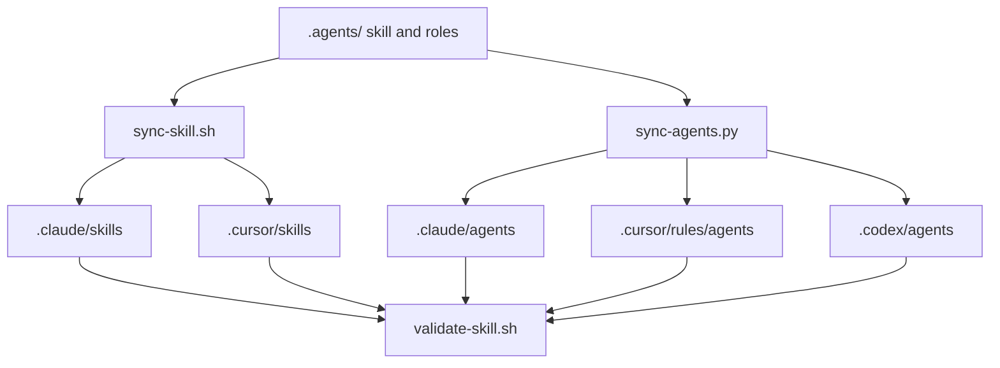
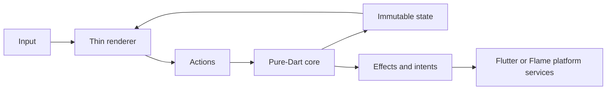

# Architecture

The repository separates canonical agent knowledge, generated host surfaces,
game-domain code, and executable evidence.

## Source of truth

Only `.agents/` is edited directly. Host-specific copies are generated and must
match the canonical content. CI rejects drift.

## Task execution

1. `ai-context-pack.py` discovers projects, modes, rules, and current findings.
2. `task-router.py` classifies compound RU/EN intents and selects workflows,
   references, templates, agents, and required checks.
3. `game-coordinator` creates a dependency-aware delegation plan.
4. Specialist roles execute sequentially or in parallel according to their
   dependencies and model tiers.
5. `self-review-loop.py` runs static and compiler-backed evidence and lists the
   manual device checks that remain.

## Game architecture

The pure-Dart core owns rules, deterministic random behavior, state transitions,
physics decisions, scoring, level validation, and collision outcomes. It imports
neither Flutter nor Flame. Renderers translate input into actions and state into
pixels. Audio, persistence, navigation, and store APIs stay at the edge.

## Rendering modes

| Mode | Best for | Runtime boundary |
|---|---|---|
| Flutter widgets | puzzles, memory, coloring, turn-based boards | Flutter gestures and widgets over pure Dart |
| Flame | runners, platformers, continuous motion | `FlameGame` and components over pure Dart |
| Hybrid | action playfield plus menus, HUD, settings | Flame `GameWidget` with Flutter overlays |

## Agent model tiers

Eight heavy roles own high-cost reasoning, three medium roles own structured QA
and release work, and three light roles own template-driven content. The tier is
portable; each host resolves it to an available model family. See
[model-routing.md](../.agents/skills/dart-mobile-game-studio/references/model-routing.md).

## Trust boundaries

- Installers never overwrite unmanaged root instructions.
- Destructive automation requires a clean, known Git repository and savepoint.
- Toolchain absence is reported as unverified.
- Store credentials and signing material are never stored in the repository.
- Asset licensing and final store declarations always retain a manual owner.
